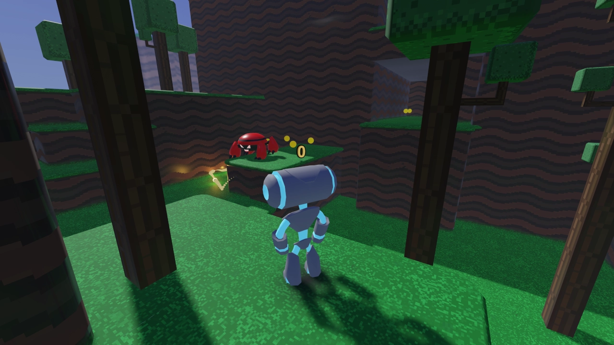

# Platformer 3D
This is a port from: https://github.com/godotengine/godot-demo-projects/tree/master/3d/platformer. Not converted was the `VirtualJoystick`.

3D Platformer demo using a
[`CharacterBody3D`](https://docs.godotengine.org/en/latest/classes/class_characterbody3d.html).
It uses similar code to the 2D platformer, but implemented in 3D.

Language: Python

Renderer: Forward+

This project uses Virtual joystick add-on by [`Marco F`](https://github.com/MarcoFazioRandom) for touch screen input.
Check it out: https://godotengine.org/asset-library/asset/1787

## Screenshots

